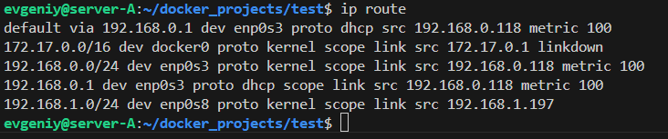

ip ip link

sudo ip route add 192.168.1.200/32 dev br-ead59a1f6b24

docker exec -it cassandra_01 apt update && sudo apt install -y ssh

docker exec -it cassandra_01 echo PermitRootLogin yes >> /etc/ssh/sshd_config

docker exec -it cassandra_01 /etc/init.d/ssh start

docker exec -it cassandra_01 passwd

ssh root@192.168.1.200

cqlsh 192.168.1.200
cqlsh 192.168.1.201
cqlsh 192.168.1.202

