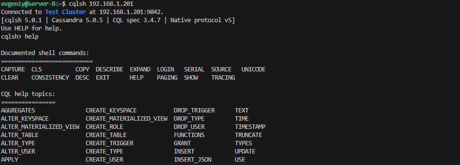

### Выводим информацию о версии операционных систем
## *cat /etc/\*release\**
#### На виртуальной машине А: 

#### На виртуальной машине B:

### Выводим информацию о адресе машин в локальной сети
## *ip a show enp0s8*
#### На виртуальной машине А: 

#### На виртуальной машине B:

### Теперь на сервере А выполним запуск файла docker-compose.yml который выполнит установку трех
### docker контейнеров с базой данных Cassandra, имеющих сетевые адреса: *192.168.1.200, 192.168.1.201, 192.168.1.202*
## *docker-compose up -d*

### Проверяем что контейнеры работают
## *docker ps*

### Выводим информаци о сетевых адресах запущенных контейнеров
## *docker network inspect test_clusternet*
 

### Далее подключаемся с сервера B к каждому контейнеру через утилиту cqlsh
## *cqlsh 192.168.1.200*

## *cqlsh 192.168.1.201*

## *cqlsh 192.168.1.202*

### Теперь необходимо настроить SSH сервер внутри контейнера с IP адресом *192.168.1.200*
### Для это вначале выполним обновление и установку необходимых пакетов
## *docker exec -it cassandra_01 apt update*
## *docker exec -it cassandra_01 apt install -y ssh*
### Установим пароль для пользователя root
## *docker exec -it cassandra_01 passwd*

### Далее подключимся к контейнеру и разрешим соединение по  SSH для пользователя root
## *docker exec -it cassandra_01 bash*
## *echo PermitRootLogin yes >> /etc/ssh/sshd_config*

### Запускаем службу SSH внутри контейнера
## *docker exec -it cassandra_01 /etc/init.d/ssh start*

### Для обеспечения сетевой доступности с контейнером имеющим IP адрес *192.168.1.200* необходимо добавить
### сетевой маршрут интерфейсу *br-28de1fe84ef6* 

### Запускаем команду:
## *sudo ip route add 192.168.1.200/32 dev br-28de1fe84ef6*
### Проверяем что маршрут добавлен
## *ip route*
 <!-- ip route -->

## *ssh root@192.168.1.200*

