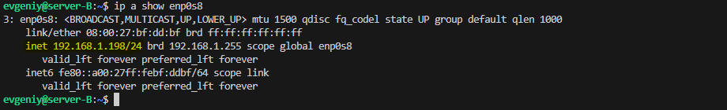
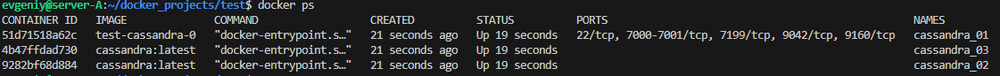

Создать Docker Compose скрипт для развертки кластера из трех инстансов cassandra, причем каждый из них должен быть доступен из основной (локальной) сети по отдельному ip адресу.

# Задание
1. На машине А (ubuntu 24.04 lts) в локальной сети с ip 192.168.1.197 запускается скрипт docker-compose для поднятия 3 образов с ip адресами 192.168.1.200-202.
2. Затем с машины Б (ubuntu 24.04 lts) из той же локальной сети с ip 192.168.1.198 необходимо подключиться через cqlsh к каждой из машин-образов.
3. Настроить ssh для возможности подключения к 1.200 с 1.197
4. Все приведённые операции необходимо задокументировать и описать инструкцией с командами и объяснениями в Readme
5. Добавить скриншот результата в Readme.

# Решение

### Выводим информацию о версии операционных систем:
## *cat /etc/\*release\**
#### На server-A

#### На server-B

### Выводим информацию об адресе машин в локальной сети:
## *ip a show enp0s8*
#### На server-A

#### На server-B

### Теперь на server-А выполним запуск файла docker-compose.yml который выполнит установку трех docker контейнеров с базой данных Cassandra, имеющих сетевые адреса: *192.168.1.200, 192.168.1.201, 192.168.1.202*
### Для контейнера с именем cassandra_01 и IP 192.168.1.200 будет создан кастомный образ с именем test-cassandra-0 в котором сразу будет настроен SSH сервер и создан пользователь
### Запускаем командой:
## *docker-compose up -d*

### Проверяем что контейнеры работают:
## *docker ps*

### Выводим информацию о сетевых адресах запущенных контейнеров:
## *docker network inspect test_clusternet*

### Далее подключаемся с server-B к каждому контейнеру через сqlsh:
## *cqlsh 192.168.1.200*

## *cqlsh 192.168.1.201*

## *cqlsh 192.168.1.202*

### Все подключения выполнены успешно

### Для обеспечения сетевой доступности с контейнером имеющим IP адрес *192.168.1.200* необходимо на server-А добавить сетевой маршрут
### Для этого запустим скрипт командой:
## *sudo ./add_route_script.sh*
### Проверяем что маршрут добавлен:
## *ip route*

### Для подключения по SSH ключу нам нужно скопировать в текущую директорию файл с публичным ключом пользователя:
## *cp ~/.ssh/id_rsa.pub ./*

### Выполняем подключение по протоколу SSH:
## *ssh evgeniy@192.168.1.200*

### Подключение выполнено успешно
